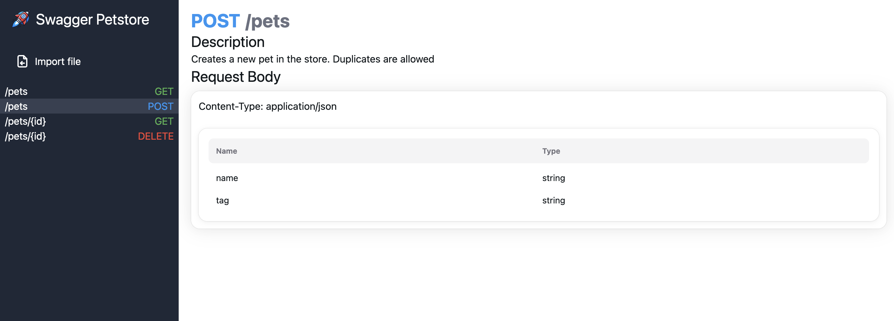

# Rocket Doc


Rocket Doc is a React application that generates documentation from an OpenAPI 3.1 file.

*Here is an example of the UI with Swagger Petstore example*


## Installation

To install the necessary dependencies, run:

```bash
yarn
```

## Running the Application

To start the development server, run:

```bash
yarn dev
```

This will start the application and you can view it in your browser.

## Usage

1. Start the development server using `yarn dev`.
2. Open your browser and navigate to the provided URL to view the generated documentation.
3. Upload the OpenAPI 3.1 from file

## Contributing

Feel free to submit issues or pull requests for any improvements or bug fixes.

## License

This project is licensed under the MIT License.
