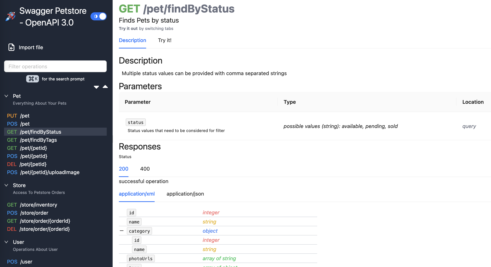

# Rocket Doc
Rocket Doc is a React app that generates documentation from an OpenAPI 3.1 files.


The goal of this project is to provide a simple and easy-to-use tool, with minimal dependencies, to allow for a maintainable and customizable documentation generation.

*Here is an example of the UI with Swagger Petstore example*


# Table of Contents

- [Rocket Doc](#rocket-doc)
- [Table of Contents](#table-of-contents)
- [Usage](#usage)
  - [As a React Component](#as-a-react-component)
  - [Directly in the Browser](#directly-in-the-browser)
- [Configuration](#configuration)
  - [AppConfig](#appconfig)
  - [Extensions](#extensions)
- [Depencies](#depencies)
  - [Building blocks](#building-blocks)
  - [For code parsing \& formatting](#for-code-parsing--formatting)
- [Features](#features)
- [Contributing](#contributing)
  - [Installation](#installation)
  - [Running the Application](#running-the-application)
- [License](#license)


# Usage

## As a React Component

You can use Rocket Doc as a React component in your application. First, install the package using yarn or npm:

```bash
yarn add @rocket-doc/app openapi3-ts tailwindcss
# or
npm install @rocket-doc/app openapi3-ts tailwindcss
```

Then, import and use the RocketDoc component in your React application:

```jsx
import React from 'react';
import ReactDOM from 'react-dom';
import { RocketDoc } from '@rocket-doc/app';

ReactDOM.render(
  <RocketDoc
    specUrl="https://api.example.com/openapi.json"
    config={{
      defaultExpandedDepth: 2,
      routerType: "hash"
    }}
  />,
  document.getElementById('root')
);
```

## Directly in the Browser

You can also use Rocket Doc directly in the browser by including the necessary scripts and adding a `<rocket-doc />` DOM element:

```html
<!DOCTYPE html>
<html lang="en">
  <head>
    <meta charset="UTF-8" />
    <link rel="icon" type="image/png" href="/rocket-doc.png" />
    <meta name="viewport" content="width=device-width, initial-scale=1.0" />
    <title>Rocket Doc</title>
    <script crossorigin src="https://unpkg.com/react@18/umd/react.development.js"></script>
    <script crossorigin src="https://unpkg.com/react-dom@18/umd/react-dom.development.js"></script>
    <script crossorigin src="https://unpkg.com/@rocket-doc/app@1.0.1/dist/index.umd.js"></script>
  </head>
  <body>
    <rocket-doc
     spec-url="https://api.example.com/openapi.json"
     config='{"defaultExpandedDepth": 2, "routerType": "hash"}'
     />
  </body>
</html>
```

# Configuration

You can configure the Rocket Doc component using the following options, either as props in the React component or as attributes in the DOM element. All options are optional.
**Object attributes (in the DOM element) should be passed as JSON strings.**


| Prop name                    | Attribute Name                  | Type                     | Description                                                                                                                            |
| ---------------------------- | ------------------------------- | ------------------------ | -------------------------------------------------------------------------------------------------------------------------------------- |
| `config`                     | `config`                        | `AppConfig`              | The application configuration object. This can include various settings to customize the behavior and appearance of the documentation. |
| `logo`                       | `logo`                          | `string`                 | The URL of the logo image to be displayed in the navigation bar.                                                                       |
| `specUrl`                    | `specUrl`                       | `string`                 | The URL of the OpenAPI specification file to be loaded.                                                                                |
| `specRequiredSecurity`       | `spec-required-security`        | OpenAPI `SecurityScheme` | The security scheme required to access the OpenAPI specification. It matches the OpenAPI specification for a security scheme.          |
| `specRequiredSecurityScopes` | `spec-required-security-scopes` | `string[]`               | The scopes required for the security scheme.                                                                                           |
| `showFileImport`             | `show-file-import`              | `boolean`                | A boolean flag to show or hide the file import option in the UI.                                                                       |
| `extensions`                 | `extensions`                    | `Extensions`             | An object containing extensions to customize the behavior of the documentation.                                                        |

## AppConfig

The AppConfig object allows you to customize various settings for the Rocket Doc application. Below are the available options:

| Option Name            | Type                  | Default        | Description                                                                              |
| ---------------------- | --------------------- | -------------- | ---------------------------------------------------------------------------------------- |
| `defaultExpandedDepth` | `number`              | `2`            | The default depth to which the documentation tree should be expanded.                    |
| `routerType`           | `'hash' \| 'browser'` | `'hash'`       | The type of router to use for navigation.                                                |
| `basePath`             | `string`              | `''`           | The base path for the application. Useful if the app is served from a subdirectory.      |
| `defaultTitle`         | `string`              | `'Rocket Doc'` | The default title for the documentation pages. Before it is loaded from the OpenAPI file |


## Extensions

The Extensions object allows you to customize the rendering of the Rocket Doc application.
An extension is a function that takes arguments and returns a component to render.
Below are the available options:

| Property     | Type                                                                                                                                                | Description                                                                                                                                                                                                                                                    |
| ------------ | --------------------------------------------------------------------------------------------------------------------------------------------------- | -------------------------------------------------------------------------------------------------------------------------------------------------------------------------------------------------------------------------------------------------------------- |
| fieldDetails | `(req: { name: string; schema: SchemaObject; fullSpec: OpenAPIObject }) => { component: (null \| React.ComponentType); disablePadding?: boolean; }` | This function is called for every field in a schema.<br/>It takes the name of the field, the OAPI schema and the OAPI fullSpec. It must return a react component (`null` for no row to be rendered), and an optional boolean to disable left aligment padding. |


# Depencies

The goal of this project is to have minimal dependencies. The following are the dependencies used in this project:

## Building blocks

- [React](https://reactjs.org/)
- [Vite](https://vitejs.dev/)
- [Ant Design](https://ant.design/)
- [Tailwind CSS](https://tailwindcss.com/)
- [Tabler Icons](https://tablericons.com/)
- [React Router DOM](https://www.npmjs.com/package/react-router-dom)


## For code parsing & formatting
- [PrismJS](https://prismjs.com/)
- [Code Editor](https://www.npmjs.com/package/react-simple-code-editor) # Edition overlay for PrismJS
- [Fast XML Parser](https://www.npmjs.com/package/fast-xml-parser)
- [YAML](https://www.npmjs.com/package/yaml)
- [React Markdown](https://www.npmjs.com/package/react-markdown)

# Features

- [x] OpenAPI 3.1 support
- [x] Schema display
- [x] Operations filtering
- [x] Try it out feature
- [x] Code generation for requests
- [x] Syntax highlighting for requests and responses
- [x] Support for loading OpenAPI files from URL
- [x] Support to retain application credentials
- [x] Support for authenticated routes to get OpenAPI files
- [x] Support for OpenAPI extensions
- [ ] Support for webhooks
- [ ] Support for OAuth 2.0
- [ ] Customizable theme

# Contributing

Feel free to submit issues or pull requests for any improvements or bug fixes.

## Installation

To install the necessary dependencies, run:

```bash
yarn
```

## Running the Application

To start the development server, run:

```bash
yarn dev
```

This will start the application and you can view it in your browser.

# License

This project is licensed under the MIT License.
