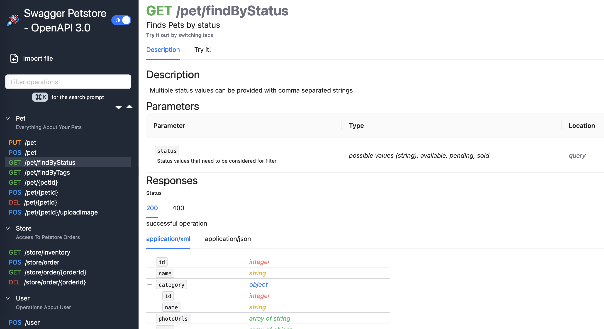

# Rocket Doc
Rocket Doc is a React app that generates documentation from an OpenAPI 3.1 files.


The goal of this project is to provide a simple and easy-to-use tool, with minimal dependencies, to allow for a maintainable and customizable documentation generation.

*Here is an example of the UI with Swagger Petstore example*


# Table of Contents

- [Rocket Doc](#rocket-doc)
- [Table of Contents](#table-of-contents)
- [Usage](#usage)
  - [As a React Component](#as-a-react-component)
  - [Directly in the Browser](#directly-in-the-browser)
- [Configuration](#configuration)
  - [AppConfig](#appconfig)
  - [Extensions](#extensions)
- [Depencies](#depencies)
  - [Building blocks](#building-blocks)
  - [For code parsing \& formatting](#for-code-parsing--formatting)
- [Features](#features)
- [OpenAPI support map](#openapi-support-map)
  - [Document structure](#document-structure)
  - [Paths \& operations](#paths--operations)
  - [Parameters](#parameters)
  - [Request bodies \& responses](#request-bodies--responses)
  - [Schemas](#schemas)
  - [Security schemes](#security-schemes)
  - [References](#references)
- [Contributing](#contributing)
  - [Installation](#installation)
  - [Running the Application](#running-the-application)
  - [Quality checks](#quality-checks)
- [License](#license)


# Usage

## As a React Component

You can use Rocket Doc as a React component in your application. First, install the package using yarn or npm:

```bash
yarn add @rocket-doc/app openapi3-ts tailwindcss
# or
npm install @rocket-doc/app openapi3-ts tailwindcss
```

Then, import and use the RocketDoc component in your React application:

```jsx
import React from 'react';
import ReactDOM from 'react-dom';
import { RocketDoc } from '@rocket-doc/app';

ReactDOM.render(
  <RocketDoc
    specUrl="https://api.example.com/openapi.json"
    config={{
      defaultExpandedDepth: 2,
      routerType: "hash"
    }}
  />,
  document.getElementById('root')
);
```

## Directly in the Browser

You can also use Rocket Doc directly in the browser by including a single script and adding a `<rocket-doc />` DOM element.
The standalone bundle embeds React, ReactDOM and the styles, so nothing else is needed:

```html
<!DOCTYPE html>
<html lang="en">
  <head>
    <meta charset="UTF-8" />
    <link rel="icon" type="image/png" href="/rocket-doc.png" />
    <meta name="viewport" content="width=device-width, initial-scale=1.0" />
    <title>Rocket Doc</title>
    <script crossorigin src="https://unpkg.com/@rocket-doc/app/dist/index.standalone.umd.js"></script>
  </head>
  <body>
    <rocket-doc
     spec-url="https://api.example.com/openapi.json"
     config='{"defaultExpandedDepth": 2, "routerType": "hash"}'
     />
  </body>
</html>
```

If you already serve React yourself, use `dist/index.umd.js` instead, which expects `React` and `ReactDOM` as globals:

```html
<!DOCTYPE html>
<html lang="en">
  <head>
    <meta charset="UTF-8" />
    <link rel="icon" type="image/png" href="/rocket-doc.png" />
    <meta name="viewport" content="width=device-width, initial-scale=1.0" />
    <title>Rocket Doc</title>
    <script crossorigin src="https://unpkg.com/react@18/umd/react.development.js"></script>
    <script crossorigin src="https://unpkg.com/react-dom@18/umd/react-dom.development.js"></script>
    <script crossorigin src="https://unpkg.com/@rocket-doc/app@1.0.1/dist/index.umd.js"></script>
  </head>
  <body>
    <rocket-doc
     spec-url="https://api.example.com/openapi.json"
     config='{"defaultExpandedDepth": 2, "routerType": "hash"}'
     />
  </body>
</html>
```

# Configuration

You can configure the Rocket Doc component using the following options, either as props in the React component or as attributes in the DOM element. All options are optional.
**Object attributes (in the DOM element) should be passed as JSON strings.**


| Prop name                    | Attribute Name                  | Type                     | Description                                                                                                                            |
| ---------------------------- | ------------------------------- | ------------------------ | -------------------------------------------------------------------------------------------------------------------------------------- |
| `config`                     | `config`                        | `AppConfig`              | The application configuration object. This can include various settings to customize the behavior and appearance of the documentation. |
| `logo`                       | `logo`                          | `string`                 | The URL of the logo image to be displayed in the navigation bar.                                                                       |
| `specUrl`                    | `specUrl`                       | `string`                 | The URL of the OpenAPI specification file to be loaded.                                                                                |
| `specRequiredSecurity`       | `spec-required-security`        | OpenAPI `SecurityScheme` | The security scheme required to access the OpenAPI specification. It matches the OpenAPI specification for a security scheme.          |
| `specRequiredSecurityScopes` | `spec-required-security-scopes` | `string[]`               | The scopes required for the security scheme.                                                                                           |
| `showFileImport`             | `show-file-import`              | `boolean`                | A boolean flag to show or hide the file import option in the UI.                                                                       |
| `extensions`                 | `extensions`                    | `Extensions`             | An object containing extensions to customize the behavior of the documentation.                                                        |

## AppConfig

The AppConfig object allows you to customize various settings for the Rocket Doc application. Below are the available options:

| Option Name            | Type                  | Default        | Description                                                                              |
| ---------------------- | --------------------- | -------------- | ---------------------------------------------------------------------------------------- |
| `defaultExpandedDepth` | `number`              | `2`            | The default depth to which the documentation tree should be expanded.                    |
| `routerType`           | `'hash' \| 'browser'` | `'hash'`       | The type of router to use for navigation.                                                |
| `basePath`             | `string`              | `''`           | The base path for the application. Useful if the app is served from a subdirectory.      |
| `defaultTitle`         | `string`              | `'Rocket Doc'` | The default title for the documentation pages. Before it is loaded from the OpenAPI file |


## Extensions

The Extensions object allows you to customize the rendering of the Rocket Doc application.
An extension is a function that takes arguments and returns a component to render.
Below are the available options:

| Property     | Type                                                                                                                                                | Description                                                                                                                                                                                                                                                    |
| ------------ | --------------------------------------------------------------------------------------------------------------------------------------------------- | -------------------------------------------------------------------------------------------------------------------------------------------------------------------------------------------------------------------------------------------------------------- |
| fieldDetails | `(req: { name: string; schema: SchemaObject; fullSpec: OpenAPIObject }) => { component: (null \| React.ComponentType); disablePadding?: boolean; }` | This function is called for every field in a schema.<br/>It takes the name of the field, the OAPI schema and the OAPI fullSpec. It must return a react component (`null` for no row to be rendered), and an optional boolean to disable left aligment padding. |


# Depencies

The goal of this project is to have minimal dependencies. The following are the dependencies used in this project:

## Building blocks

- [React](https://reactjs.org/)
- [Vite](https://vitejs.dev/)
- [Ant Design](https://ant.design/)
- [Tailwind CSS](https://tailwindcss.com/)
- [Tabler Icons](https://tablericons.com/)
- [React Router DOM](https://www.npmjs.com/package/react-router-dom)


## For code parsing & formatting
- [PrismJS](https://prismjs.com/)
- [Code Editor](https://www.npmjs.com/package/react-simple-code-editor) # Edition overlay for PrismJS
- [Fast XML Parser](https://www.npmjs.com/package/fast-xml-parser)
- [YAML](https://www.npmjs.com/package/yaml)
- [React Markdown](https://www.npmjs.com/package/react-markdown)

# Features

- [x] OpenAPI 3.1 support
- [x] Schema display
- [x] Operations filtering
- [x] Try it out feature
- [x] Code generation for requests
- [x] Syntax highlighting for requests and responses
- [x] Support for loading OpenAPI files from URL
- [x] Support to retain application credentials
- [x] Support for authenticated routes to get OpenAPI files
- [x] Support for OpenAPI extensions
- [x] Support for webhooks
- [x] Dedicated page to manage security keys, shared with "Try it"
- [x] Responsive/mobile layout
- [ ] Support for OAuth 2.0 flows (schemes are documented, tokens must be pasted manually)
- [ ] Customizable theme

# OpenAPI support map

The tables below describe how each part of the [OpenAPI 3.1 specification](https://spec.openapis.org/oas/v3.1.0.html) is
handled. `Full` means the field is used as specified, `Partial` means only part of its semantics is applied (see notes),
and `None` means the field is currently ignored.

## Document structure

| Field                       | Support | Notes                                                                          |
| --------------------------- | ------- | ------------------------------------------------------------------------------ |
| `openapi`                   | Full    | 3.1 documents, 3.0 documents render but 3.0-only semantics are not applied     |
| `info.title` / `version`    | Full    | Shown on the home page and used as document title                              |
| `info.summary`              | Full    | 3.1 only                                                                       |
| `info.description`          | Full    | Rendered as markdown                                                           |
| `info.contact` / `license`  | Full    | Links to email, URL and license identifier/URL                                 |
| `info.termsOfService`       | Full    |                                                                                |
| `servers`                   | Full    | Listed on the home page, used as "Try it" base URLs                            |
| `servers[].variables`       | Full    | `enum` values are offered as a list, other variables are free text             |
| `tags`                      | Partial | `name` drives sidebar grouping and ordering, `description` is not rendered yet  |
| `externalDocs`              | Full    | Shown on the home page and on each operation                                   |
| `webhooks`                  | Full    | Listed in their own sidebar section, with their own routes                     |
| `components.schemas`        | Full    | Referenced from operations, counted on the home page                           |
| `components.securitySchemes`| Full    | See [Security schemes](#security-schemes)                                      |
| `components.*` (others)     | Full    | Resolved through `$ref` where the referring field is supported                  |
| `x-*` extensions            | Partial | Exposed to the `fieldDetails` extension point, plus built-in `x-unit`          |

## Paths & operations

| Field                                  | Support | Notes                                                                |
| -------------------------------------- | ------- | -------------------------------------------------------------------- |
| `paths` + all 8 HTTP methods           | Full    | `get`, `put`, `post`, `delete`, `options`, `head`, `patch`, `trace`   |
| `pathItem.summary` / `description`     | Partial | Operation level values are displayed, path item level ones are not   |
| `pathItem.parameters`                  | Full    | Merged into every operation of the path item                         |
| `pathItem.servers`                     | Full    | Inherited by operations that declare no `servers`                    |
| `operation.operationId`                | Full    | Displayed and searchable                                             |
| `operation.summary` / `description`     | Full    | Description rendered as markdown                                     |
| `operation.tags`                       | Full    | An operation appears under each of its tags                          |
| `operation.deprecated`                 | Full    | Shown as a badge                                                     |
| `operation.servers`                    | Full    | Take precedence over path item and document servers                  |
| `operation.security`                   | Full    | Falls back to the document `security`, alternatives are selectable    |
| `operation.externalDocs`               | Full    |                                                                      |
| `operation.callbacks`                  | None    | Not rendered                                                         |

## Parameters

| Field                                | Support | Notes                                                            |
| ------------------------------------ | ------- | ---------------------------------------------------------------- |
| `in: path` / `query` / `header`       | Full    | Editable in "Try it"                                             |
| `in: cookie`                         | Partial | Documented, but not sent by "Try it" (browser restriction)        |
| `required` / `deprecated`            | Full    |                                                                  |
| `description`                        | Full    | Rendered as markdown                                             |
| `schema`                             | Full    | Drives the input type and the generated example                  |
| `example` / `examples`               | Partial | First example is used as default value                           |
| `content`                            | Partial | Serialized as the raw media type value                           |
| `style` / `explode` / `allowReserved`| None    | Values are sent using the default form/simple serialization       |

## Request bodies & responses

| Field                                | Support | Notes                                                        |
| ------------------------------------ | ------- | ------------------------------------------------------------ |
| `requestBody.content`                | Full    | One tab per media type, with generated examples              |
| `requestBody.required`               | Full    | Shown as a badge                                             |
| `responses` + `default`              | Full    | One section per status code                                  |
| `response.description`               | Full    | Rendered as markdown                                         |
| `response.content`                   | Full    | Schema tree + generated example per media type               |
| `response.headers`                   | Full    | Name, requirement, schema and description                    |
| `response.links`                     | None    | Not rendered                                                 |
| `encoding`                           | None    | Multipart encoding metadata is ignored                       |

## Schemas

| Keyword                                          | Support | Notes                                                        |
| ------------------------------------------------ | ------- | ------------------------------------------------------------ |
| `type` (incl. type arrays), `format`             | Full    | For type arrays the first type drives the example            |
| `properties`, `items`, `required`                | Full    |                                                              |
| `enum`, `const`, `default`, `example`, `examples`| Full    | Used for generated examples                                  |
| `allOf`                                          | Partial | Object branches are merged for display and examples          |
| `oneOf` / `anyOf`                                | Partial | First branch is used for the generated example               |
| `discriminator`                                  | None    |                                                              |
| `nullable` (3.0)                                 | Partial | Prefer 3.1 `type: ["...", "null"]`                           |
| Validation keywords (`minimum`, `pattern`, ...)  | Partial | Displayed as field details, not enforced in "Try it"          |
| `additionalProperties`                           | Partial | Documented, not part of generated examples                   |
| `readOnly` / `writeOnly`                         | None    | Examples include both                                        |
| `xml`                                            | Partial | XML examples are generated from the JSON structure           |

## Security schemes

| Type                          | Support | Notes                                                              |
| ----------------------------- | ------- | ------------------------------------------------------------------ |
| `apiKey` (header/query/cookie)| Full    | Editable per credential profile                                    |
| `http` `basic`                | Full    | Scheme name is matched case-insensitively                          |
| `http` `bearer`               | Full    |                                                                    |
| `http` (other schemes)        | None    | Displayed as not supported yet                                     |
| `mutualTLS`                   | None    | Handled by the browser/OS, nothing to configure                    |
| `oauth2`                      | Partial | Scheme and scopes are documented, no flow is executed              |
| `openIdConnect`               | Partial | Scheme is documented, no flow is executed                          |

Credentials are stored per profile in `localStorage` and shared between the "Security keys" page and "Try it".

## References

| Feature                          | Support | Notes                                                   |
| -------------------------------- | ------- | ------------------------------------------------------- |
| Local `$ref` (`#/...`)           | Full    | Chained references are followed                         |
| JSON pointer escaping (`~0`/`~1`)| Full    | RFC 6901, plus percent-decoding                         |
| Circular `$ref`                  | Full    | Detected, examples stop at the cycle                    |
| Remote/URL `$ref`                | None    | Bundle the document beforehand                          |
| `$ref` siblings (`summary`, ...) | None    | Overrides next to a `$ref` are ignored                  |

# Contributing

Feel free to submit issues or pull requests for any improvements or bug fixes.

## Installation

To install the necessary dependencies, run:

```bash
yarn
```

## Running the Application

To start the development server, run:

```bash
yarn dev
```

This will start the application and you can view it in your browser.

## Quality checks

```bash
yarn lint       # ESLint
yarn typecheck  # TypeScript, no emit
yarn test       # Vitest unit tests
yarn verify     # all of the above
```

The same checks run on every push and pull request through GitHub Actions.

# License

This project is licensed under the MIT License.
